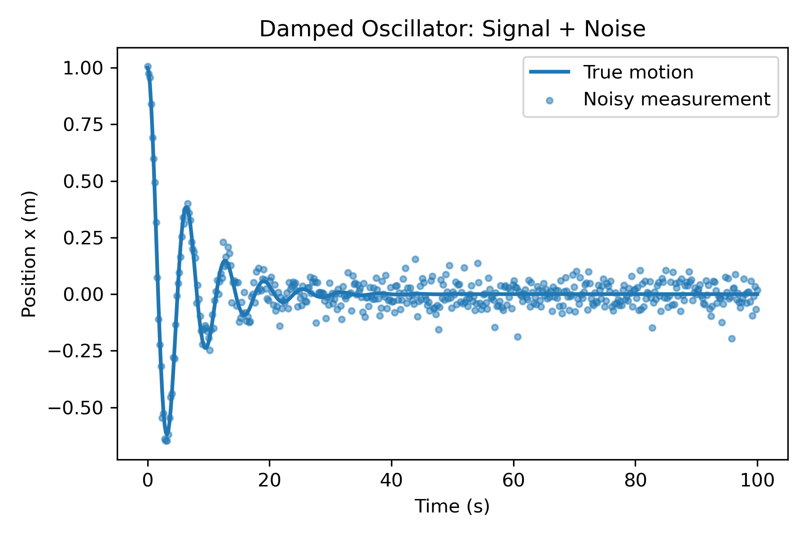

## Project Overview

This project simulates a damped harmonic oscillator by numerically solving the
equations of motion and adding Gaussian noise to represent experimental
measurement uncertainty.

The notebook demonstrates:
- numerical integration of a classical ODE
- modeling of measurement noise
- clear visualization of signal versus noise

## Example Output

The figure below shows the clean numerical solution of the damped harmonic
oscillator together with simulated noisy measurements.

